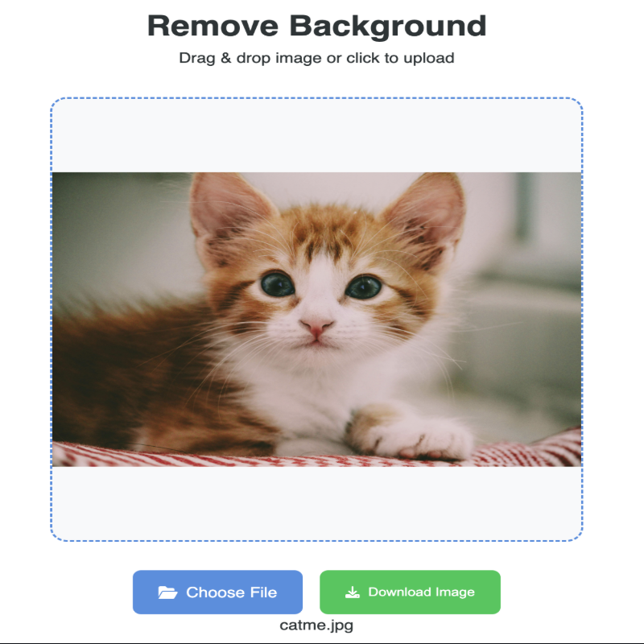

# Background Remover

This project is a web-based background remover tool that uses AI to automatically remove backgrounds from images. It is built using Python and FastAPI.

  

## U2NET Small Model

Description: U2NET small is a lightweight version of the U2NET model, optimized for real-time background removal.

### Features:

Lightweight: Smaller model size (4.7 MB) for faster loading.  
Fast Inference: Designed for real-time performance.  
High Accuracy: Maintains high accuracy despite its small size.

## Requirements

Python 3.12+  
Docker

## Getting Started

### Local Development

1. Clone the Repository:  
   `git clone https://github.com/santoshpremi/background-remover.git `  
   `cd background-remover`
2. Create a Virtual Environment:  
   `python -m venv venv` 
   `source venv/bin/activate`
3. Install Dependencies:  
   `pip install -r requirements.txt`
4. Run the Application:  
   `uvicorn main:app --host 0.0.0.0 --port 8000`  
   Navigate to http://localhost:8000 to access the app.

### Docker Image (Local & Multi-Arch)

1. **Pull the Docker Image**  
   `docker pull santoshpremi/bg-remover-01:latest`  
   Downloads the latest multi-architecture image from Docker Hub.

2. **Run the Docker Container**  
   `docker run -d -p 8000:80 santoshpremi/bg-remover-01:latest`  

   - `-d`: Runs container in detached mode (background)  
   - `-p 8000:80`: Maps host port 8000 to container port 80

3. **Verify Container Status**  
   `docker ps`  
   Lists running containers. You should see the background remover container.

4. **Access the Application**  
   Navigate to http://localhost:8000

**Multi-Architecture Support:** The Docker image supports both AMD64 and ARM64 architectures, making it compatible with Intel/AMD processors and Apple Silicon (M1/M2) Macs.

## Usage

1. Upload an Image: Click the "Choose File" button or drag an image into the drop zone.  
2. Remove Background: Click the "Download" button to process the image and downloaded.

## Contributing:

1. Fork the Repository:  
   Fork the project on GitHub.
2. Clone the Forked Repository:  
   `git clone https://github.com/santoshpremi/background-remover.git `  
   `cd background-remover`
3. Create a New Branch:  
   `git checkout -b your-feature-branch`

4. Make Changes:  
   Implement your feature or fix.

5. Commit Changes:  
   `git commit -m "Your commit message"`
6. Push Changes:  
   `git push origin your-feature-branch`
